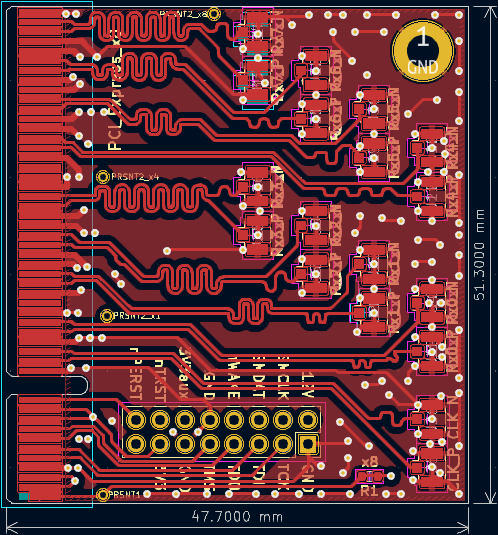
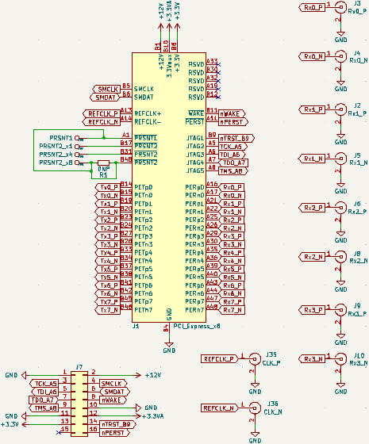
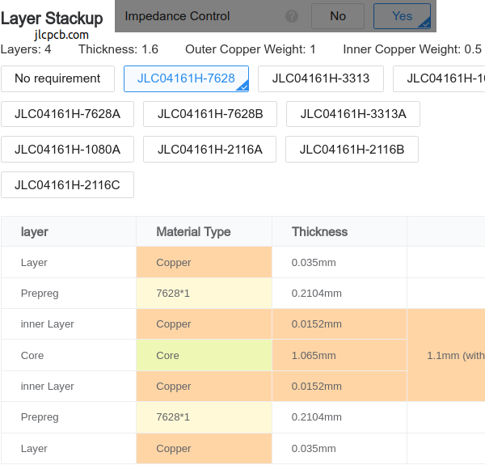

**Work-In-Progress** [Gerbers ready](https://github.com/mwrnd/PCIe_x8_Breakout/tags/v0.1-alpha) but not yet ordered.

# PCIe_x8_Breakout

PCIe x8 Signal Breakout to [U.FL/UMCC Connectors](https://en.wikipedia.org/wiki/Hirose_U.FL).

[PCIEX1-SMA](https://github.com/teknoman117/PCIEX1-SMA/tree/f63db3cca1db83d9b58e01254d8104f65855b762) is a similar project that is PCIe x1 and uses SMA connectors.

# PCB Layout

All signals are length-matched to within 1mm both inter-pair and intra-pair.

# Schematic

# PCB Layer Stackup

4-Layer PCB stackup taken from [JLCPCB](https://jlcpcb.com/capabilities/pcb-capabilities).

Differential Impedance parameters were calculated using the [DigiKey Online Calculator](https://www.digikey.com/en/resources/conversion-calculators/conversion-calculator-pcb-trace-impedance).

