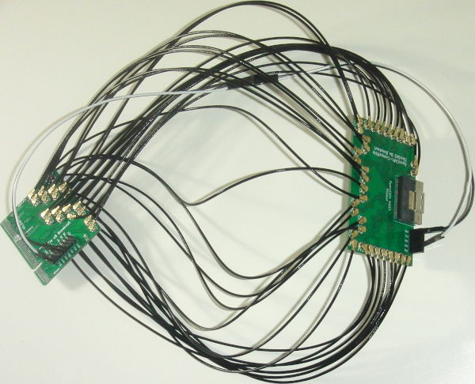
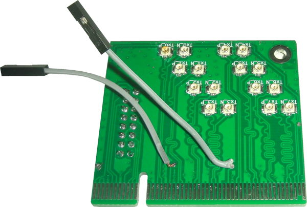

# PCIe_x8_Breakout

PCIe x8 Signal Breakout to [U.FL/UMCC Connectors](https://en.wikipedia.org/wiki/Hirose_U.FL).

[PCIEX1-SMA](https://github.com/teknoman117/PCIEX1-SMA/tree/f63db3cca1db83d9b58e01254d8104f65855b762) is a similar project that is PCIe x1 and uses SMA connectors.

The board requires up to 34 [U.FL/UMCC Surface Mount Receptacles](https://www.digikey.com/en/products/detail/te-connectivity-amp-connectors/2337019-1/9974052) and a 16-Pin 2.54mm [Header](https://www.digikey.com/en/products/detail/sullins-connector-solutions/PREC008DAAN-RC/2774886) or [Socket](https://www.digikey.com/en/products/detail/adam-tech/RS2-16-G/9832058).

# Testing and Use Example

The board is currently being used along with an [OpenCAPI_Breakout](https://github.com/mwrnd/OpenCAPI_Breakout) board to test [OpenCAPI-to-PCIe](https://github.com/mwrnd/innova2_experiments/tree/main/xdma_opencapi) on the [Innova-2 SmartNIC](https://www.nvidia.com/en-us/networking/ethernet/innova-2-flex/). PCIe 3.0 x4 at 8.0GT/s is currently working. Standard [0.1" M-F Jumpers](https://www.digikey.com/en/products/detail/adafruit-industries-llc/1954/6827087) are used for the PCIe Reset Signal (*nPERST*) and its GND.

With cables shorter than 4"~=100mm the [adapters work](https://github.com/mwrnd/innova2_experiments/tree/main/xdma_opencapi). Note the [RX U.FL-to-U.FL cables](https://www.digikey.com/en/products/detail/te-connectivity-amp-connectors/2118651-6/11205742) are all the same length as each other and likewise all [TX cables](https://www.digikey.com/en/products/detail/te-connectivity-amp-connectors/2015698-2/1249186) are the same length but RX and TX are different lengths as that is what I had access to. RX on the PCIe board connects to RX on the OpenCAPI board as it uses the OpenCAPI Host pinout. 

PCIe x4 In-system:

However, using 250mm IPEX cables the adapters fail for PCIe x8:

PCIe x8 In-system:

# PCB Layout

All signals are length-matched to within 1mm both inter-pair and intra-pair.

Resistor footprint R1 connects `PRSNT1` to `PRSNT2_x8`. The R1 trace can be cut and `PRSNT1` can be connected to a different `PRSNT2` to reduce the [PCIe lane width](https://en.wikipedia.org/wiki/PCI_Express#Lane).

Then wire jumpers can be used to connect `PRSNT1` to any of the `PRSNT2`.

# Schematic

# PCB Layer Stackup

4-Layer PCB stackup taken from [JLCPCB](https://jlcpcb.com/capabilities/pcb-capabilities).

Differential Impedance parameters were calculated using the [DigiKey Online Calculator](https://www.digikey.com/en/resources/conversion-calculators/conversion-calculator-pcb-trace-impedance).

